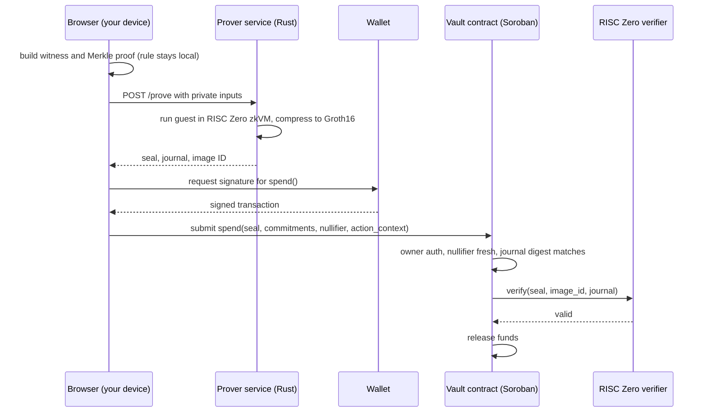
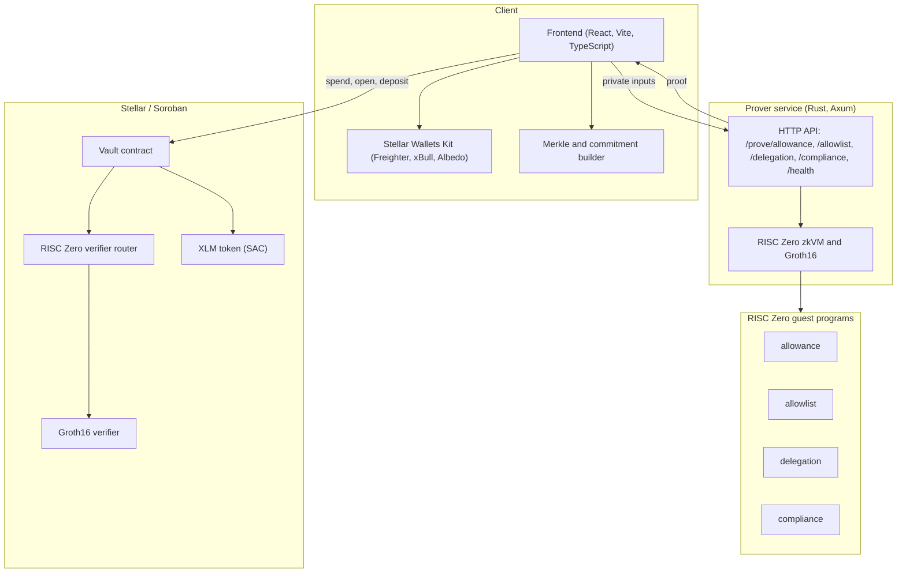

# Ciphermit

**Private, provable spending rules on Stellar.**

Ciphermit is a spending vault on Stellar (Soroban) where your rules stay secret but are still enforced on-chain. You lock funds in a vault and commit a policy as a hash. When you spend, your device produces a zero-knowledge proof (RISC Zero) that the payment obeys the hidden policy. The contract verifies the proof and only then releases funds. The rule itself never appears on the ledger.

- **Live app:** https://ciphermit.vercel.app
- **Vault contract:** [`CBHDNNIN...DW7C`](https://stellar.expert/explorer/testnet/contract/CBHDNNIN76GWDVH3IGV43J2RM3DJSLN2VTTBOU3O5WITKIOSBQ4NDW7C)
- **Network:** Stellar testnet

## Table of contents

1. [The problem](#the-problem)
2. [How it works](#how-it-works)
3. [The four policies](#the-four-policies)
4. [Architecture](#architecture)
5. [Cryptographic mechanisms](#cryptographic-mechanisms)
6. [Rolling, time-based caps](#rolling-time-based-caps)
7. [Selective disclosure (Audit)](#selective-disclosure-audit)
8. [In-app proof evidence](#in-app-proof-evidence)
9. [The application](#the-application)
10. [Deployed contracts and verified transactions](#deployed-contracts-and-verified-transactions)
11. [Tech stack](#tech-stack)
12. [Repository layout](#repository-layout)
13. [Local setup](#local-setup)
14. [Honest scope and roadmap](#honest-scope-and-roadmap)

## The problem

Public blockchains make everything visible, and that includes your financial rules. Any spending limit, approved-payee list, delegated budget, or compliance policy you enforce on-chain is readable by anyone: competitors, counterparties, and the public. Teams are stuck choosing between two bad options. They can enforce controls transparently on-chain and leak sensitive business logic, or they can keep the rules private by trusting an off-chain, centralized system, which throws away the trustlessness they came to a blockchain for.

Ciphermit removes that trade-off. The rule is enforced automatically on-chain, but the rule itself never appears on-chain. Only a cryptographic commitment and a zero-knowledge proof are published.

## How it works

The heavy cryptography runs on a prover service, not in the browser. A RISC Zero Groth16 proof needs gigabytes of RAM and is not browser-feasible. The browser does the light work: it builds the witness and any Merkle proof, then submits the final transaction. Private inputs go to the prover, the proof comes back, and the rule never touches the chain.



Step by step:

1. Your browser builds the witness, and a Merkle proof for the set-based policies. The rule stays on your side.
2. The prover service runs the policy program in the RISC Zero zkVM, then compresses the result to a Groth16 proof. It returns the seal, the journal, and the program image ID.
3. Your browser asks the wallet to sign a `spend()` transaction that carries the seal, the commitments, the nullifier, and the action context.
4. The vault contract checks owner authorization, checks the nullifier has not been used before, rebuilds and matches the journal digest, then calls the RISC Zero verifier to check the proof.
5. Only if the proof verifies are the funds released. If any check fails, nothing moves. The proof is what authorizes the transfer.

## The four policies

Each policy is a separate program (a "guest") compiled for the RISC Zero zkVM. The vault stores one expected program identity (image ID) per policy type, so a proof only passes if it came from the exact program the contract expects.

| Policy | What it proves privately | Real-world use |
|---|---|---|
| **Allowance** | A spend is within a hidden per-period cap that refills each window | Give an employee a wallet capped at 2,000 XLM per month. The limit is enforced but competitors and vendors cannot see it. |
| **Allowlist** | The recipient is a member of an approved set (Merkle membership), without revealing the set | A payroll or supplier wallet that a stolen key cannot redirect, with the approved list kept private. |
| **Delegation** | The spender is a delegate in a private set and the spend is within that delegate's hidden sub-cap | A DAO treasury that gives each working group its own secret monthly budget. |
| **Compliance** | The recipient is not on a deny-list (sorted-set non-membership) and the amount is under a threshold or accredited | A regulated fintech proving payouts skip sanctioned addresses without publishing its sanctions list. |

**Allowance**, **Allowlist**, and **Delegation** are wired end to end and verified on-chain. **Compliance** has a working guest program and prover endpoint, and is the next policy to wire through the UI.

## Architecture



Components:

- **Frontend** builds witnesses and Merkle proofs, talks to the prover over HTTP, and talks to the chain through the Stellar SDK and a connected wallet.
- **Prover service** is a Rust and Axum server that runs the guest programs in the RISC Zero zkVM and returns Groth16 proofs. It is hosted for the demo and configured through `VITE_PROVER_URL`.
- **Guest programs** are the RISC Zero circuits, one per policy. Each one enforces its rule and outputs a public journal (commitments plus the action context).
- **Vault contract** holds the funds, stores the per-policy commitments and expected image IDs, enforces owner authorization and nullifier freshness, and calls the verifier.
- **Verifier system** is a Nethermind-style RISC Zero verifier router plus a Groth16 verifier deployed on Soroban.

## Cryptographic mechanisms

A few primitives do the real work.

**Commitments hide the rule.** A policy is never sent on-chain. The vault stores a SHA-256 commitment instead. For an allowance vault it is `sha256(cap || vault_secret)`. For an allowlist it is `sha256(merkle_root || vault_secret)`. The guest recomputes the same commitment inside the proof, so the contract can confirm the proof matches the vault without ever learning the cap or the list.

**Merkle trees hide sets.** Allowlist, delegation, and compliance commit a set (approved recipients, delegate keys, or a deny-list) as a Merkle root. The browser builds the tree and generates an inclusion proof, or for compliance a sorted-set non-inclusion proof. The guest verifies membership against the root without revealing which leaf was used. The browser hashing matches the guest byte for byte (leaf tagging, node ordering, path bits), and each policy encoding was verified against the real prover before any UI was wired.

**Nullifiers stop replay.** Every spend derives a one-time nullifier `sha256(nullifier_secret || action_context)`. The contract records used nullifiers and rejects any repeat, so a valid proof cannot be submitted twice.

**Action context binds the proof to the exact transfer.** The proof commits to `sha256(owner || recipient || amount)`, and the contract recomputes it from the real transaction parameters. This prevents swapping the recipient or amount after the proof is made.

**Image ID pins the program.** The `spend` function never accepts an image ID from the caller. The vault holds the expected image ID per policy in contract storage and passes it to the verifier, so a spend can only succeed with a proof from the exact guest program the admin configured.

## Rolling, time-based caps

Allowance caps are not a one-time budget. You pick a reset window when you open the vault (1 minute, 1 hour, 1 day, or 30 days). The period id is derived from wall clock time as `floor(now / window)`, and spending is tracked per period, so the cap automatically refills when the window rolls over. The Authorize screen shows a live indicator, for example "5.00 XLM left this period, resets in 0:12". The rule commitment is period-independent in the guest, so the same vault verifies across windows.

## Selective disclosure (Audit)

Because everything is private, an auditor sometimes needs to verify one payment. The Audit tool does selective disclosure. Pick a single past transaction, enter the vault view key, and reveal only that one transaction's details (owner, recipient, amount, time). Every other transaction stays hidden. This is the "prove one payment was compliant without opening the whole book" idea.

## In-app proof evidence

You should not have to take it on trust that real zero-knowledge is happening. After a spend, the app shows the actual proof: the Groth16 seal, the guest image ID, the journal digest, the nullifier, and the policy commitment, each labeled with what it is, plus a link to the on-chain RISC Zero verifier contract and the spend transaction. The proof is stored with the activity record, so it can be re-inspected any time through the Audit reveal without regenerating it.

## The application

The app is a full product with a persistent sidebar and several screens. This is a tour of every feature.

### Onboarding and connect

A landing walkthrough introduces the idea across a few screens (the problem, the three steps, a live proof demo, and a launch screen). The connect screen lists Freighter, xBull, and Albedo as cards. Click a card to connect that wallet directly, or use "choose from all wallets" for the full picker. Albedo is web-based, so anyone can connect without an extension. The sidebar shows the network, the connected address, and a disconnect control.

### Overview (dashboard)

Three summary tiles with count-up values (total escrowed, active vaults, authorized spends), then your vaults, then recent activity. Each section has an info affordance that explains what it is and why it matters.

### Opening a vault

A guided modal. First pick a policy, where each option shows how it works and a real-world use case. Then set the rule and fund it:

- Allowance takes a period cap and a reset window (1 minute up to 30 days), and shows a live commitment-hash preview so you can watch the rule turn into a hash.
- Allowlist takes the approved recipient addresses.
- Delegation takes a delegate list, one private sub-cap each.

Issuing runs three transactions in sequence: approve the token, `open_vault`, then `deposit`. A success screen links the transaction and takes you to the vault.

### Vaults and vault cards

Each vault is a card with its policy type, id, and escrow balance. A "limit private" marker sits where the hidden rule would be. Card actions are Authorize, Deposit, and Manage. When you have no vaults yet, a structured empty state shows a live call to action next to the four policy types, so the screen still explains itself.

### Vault detail

A full page with tabs:

- Overview: the policy summary and quick actions.
- Spends: this vault's spend history.
- Delegates: for delegation vaults, the delegate list.
- Settings: the cryptographic config (policy commitment, spent commitment, period, owner) with copy buttons, and a shortcut into Audit.

### Authorize and the live proof receipt

The spend screen. On the left you choose the vault, recipient, and amount. Delegation vaults add a delegate selector, and allowance vaults show a live "X XLM left this period, resets in ..." indicator. On the right is the live proof receipt, which is the signature moment of the app:

- While proving, the private values blur behind a shimmer and a timer counts up with an estimate.
- The stage text moves from "Proving privately" to "Submitting" to "Verifying on Stellar" to "Authorized".
- On success the receipt turns to an accent border, a verified badge appears, the transaction hash types itself in, and a "View on Stellar" link opens the explorer.
- A failure shows the real reason instead of a generic error.

Right below the receipt sits the proof evidence panel described earlier (seal, image ID, journal digest, nullifier, commitment, plus the on-chain verifier link).

### Deposits

Add funds to any vault from a small modal. It runs approve then `deposit`, reads the fresh on-chain balance, and confirms with a transaction link. Deposits show up in Activity.

### Delegates

Grant a delegate a private, capped, revocable sub-budget from a vault. The grant derives a real sub-cap commitment on your device. The active delegates table shows each delegate (address truncated), the vault, the grant time, and a status chip, with a confirm step before a revoke.

### Activity (the history ledger)

A full-width ledger of everything done in the session, laid out as a table with columns for type, amount, recipient, vault, transaction, time, and status. Filter chips narrow the view by type (spends, deposits, opens, grants, revokes) or by a specific vault. Spends, deposits, and opens carry their real on-chain transaction hash and link to the explorer. Local-only actions are marked as such. Each spend also stores its proof, so it can be reopened in Audit later.

### Receipts and evidence in one place

Every spend produces two things you can point at: the animated receipt on the Authorize screen (recipient, amount, verified badge, transaction link) and the cryptographic proof panel (seal, image ID, journal digest, nullifier, commitment, and the on-chain verifier link). Both are kept in the activity record, so the receipt and the proof for a past spend can be reopened through the Audit reveal without regenerating anything.

### Guidance and empty states

Core features carry a clickable "how it works" affordance with a plain explanation and a use case. Empty screens show the real tool in a ready or disabled state (for example, the vault grid shape, or the audit tool with a "nothing to disclose yet" note) instead of a blank page.

### Wallets

Freighter, xBull, and Albedo are supported. Albedo is web-based, so anyone can connect without installing an extension. Keys never leave the browser, and on testnet a fresh account is funded through friendbot.

## Deployed contracts and verified transactions

All on Stellar testnet.

| What | Address | Explorer |
|---|---|---|
| Vault contract | `CBHDNNIN76GWDVH3IGV43J2RM3DJSLN2VTTBOU3O5WITKIOSBQ4NDW7C` | [view](https://stellar.expert/explorer/testnet/contract/CBHDNNIN76GWDVH3IGV43J2RM3DJSLN2VTTBOU3O5WITKIOSBQ4NDW7C) |
| RISC Zero verifier router | `CBI2UZ3K4HZW2Y3JK5DAXN2BVGCNFZTLUIOQV7JRGAOEMNA4DUZFF4O2` | [view](https://stellar.expert/explorer/testnet/contract/CBI2UZ3K4HZW2Y3JK5DAXN2BVGCNFZTLUIOQV7JRGAOEMNA4DUZFF4O2) |
| XLM token (Stellar Asset Contract) | `CDLZFC3SYJYDZT7K67VZ75HPJVIEUVNIXF47ZG2FB2RMQQVU2HHGCYSC` | [view](https://stellar.expert/explorer/testnet/contract/CDLZFC3SYJYDZT7K67VZ75HPJVIEUVNIXF47ZG2FB2RMQQVU2HHGCYSC) |

Each policy below was verified end to end on testnet (open the vault, deposit, generate a real proof, submit the spend, funds released only after the verifier accepted the proof):

| Policy | Spend transaction |
|---|---|
| Allowance (rolling period) | [`092a7581...fca22`](https://stellar.expert/explorer/testnet/tx/092a7581f935a3bcd0d73c880118a8d5c449393e2e507e969caea5be5f1fca22) |
| Allowlist | [`2d8591e0...c3e02`](https://stellar.expert/explorer/testnet/tx/2d8591e0b94b29f1460046e7974aa8695460799854264da05481a0f46f0c3e02) |
| Delegation | [`e03cd273...6efff`](https://stellar.expert/explorer/testnet/tx/e03cd273c3919bd03dbed5c5f02fa25636a2fb3ae6c6c1b5c656ff10a176efff) |

Open any spend transaction and look at the diagnostic events. You will see the vault calling `verify(seal, image_id, journal)` on the verifier router, which runs the RISC Zero Groth16 verifier. That call is the zero-knowledge verification happening on-chain.

## Tech stack

- **Smart contracts**: Rust on Soroban (Stellar). A vault contract, plus a RISC Zero verifier router and Groth16 verifier.
- **Zero-knowledge**: RISC Zero zkVM, four guest programs, Groth16 proofs.
- **Prover service**: Rust and Axum, generating Groth16 proofs over HTTP.
- **Frontend**: Vite, React, TypeScript, Tailwind CSS, framer-motion, Stellar Wallets Kit, Stellar SDK.
- **Network**: Stellar testnet. XLM (as a Soroban asset contract) is the escrow token.

## Repository layout

```
ciphermit/
  contracts/vault/     Soroban vault contract (Rust)
  verifier/            RISC Zero verifier router and Groth16 verifier contracts
  guest/
    methods/guest/     the four zkVM guest programs (allowance, allowlist, delegation, compliance)
    host/              the prover service (Rust, Axum HTTP API)
  web/                 frontend (Vite, React, TypeScript)
  scripts/             deploy, prover start, image-id, and end-to-end helper scripts
  docs/                architecture and design notes
  Dockerfile.prover    container build for the prover
```

## Local setup

There are three parts: the frontend, the prover service, and the contracts. The contracts are already deployed on testnet, so in most cases you only need the frontend pointed at a prover.

### Prerequisites

- Node.js 23 (a `.nvmrc` pins it, so `nvm use` works)
- Rust (stable) with `rustup`
- For the prover: the RISC Zero toolchain (`rzup`), Docker running, and an x86_64 machine with about 16 GB of RAM. The Groth16 step runs in a Docker container and is memory heavy.
- Optional, for deploying contracts yourself: the Stellar CLI

### 1. Frontend

```bash
cd web
cp .env.example .env      # then edit VITE_PROVER_URL if you run your own prover
nvm use                   # Node 23
npm install
npm run dev               # http://localhost:5173
```

Environment variables (`web/.env`):

```
VITE_NETWORK=testnet
VITE_VAULT_CONTRACT_ID=CBHDNNIN76GWDVH3IGV43J2RM3DJSLN2VTTBOU3O5WITKIOSBQ4NDW7C
VITE_TOKEN_CONTRACT_ID=CDLZFC3SYJYDZT7K67VZ75HPJVIEUVNIXF47ZG2FB2RMQQVU2HHGCYSC
VITE_PROVER_URL=http://localhost:3001
```

To use the app you need a testnet account. Connect a wallet (Albedo needs no extension), then fund the account with friendbot at https://friendbot.stellar.org.

Note: a real proof takes several minutes to generate, so the Authorize flow shows a "Proving" state with a timer before it asks you to sign.

### 2. Prover service

The prover needs the RISC Zero toolchain and Docker.

```bash
# install the RISC Zero toolchain
curl -L https://risczero.com/install | bash
source ~/.bashrc
rzup install
rzup install rust
rzup install risc0-groth16

# make sure Docker is running (needed for the Groth16 step)

# build and start the prover on port 3001
./scripts/start-prover.sh
# or manually:
cd guest && cargo build --release && PROVER_PORT=3001 ./target/release/prover
```

The prover exposes:

```
GET  /health
POST /prove/allowance
POST /prove/allowlist
POST /prove/delegation
POST /prove/compliance
```

Point the frontend at it with `VITE_PROVER_URL=http://localhost:3001`. If you host the prover behind a domain for a deployed frontend, make sure it is HTTPS, since browsers block HTTPS pages from calling HTTP.

### 3. Contracts (optional, already deployed)

The vault and verifier are already live on testnet, so this is only needed if you want to deploy your own.

```bash
# build the vault contract
stellar contract build --package ciphermit-vault

# deploy and initialize (uses a stellar CLI identity named ciphermit-dev)
./scripts/deploy-vault.sh

# after building the guests, register each guest image ID with the vault
./scripts/extract-image-ids.sh
./scripts/set-image-ids.sh
```

The image IDs must match the guest programs the prover is running. If you rebuild a guest, its image ID changes, so re-run `set-image-ids.sh` to keep the contract and the prover in sync.

## Honest scope and roadmap

- Three policies (allowance, allowlist, delegation) are fully wired and verified on-chain. Compliance is built at the guest and prover layer and is the next to wire through the UI.
- Proving runs on a hosted prover service, so the strong and true claim is that policies never touch the chain. A production build would run the prover locally or in a trusted enclave, so the witness never leaves the user.
- Next steps: bind the running spent total to on-chain state for fully trustless cumulative caps, persist activity beyond a session, and turn the view key into a cryptographic disclosure capability.
